# Tests Dcoumentation

## Readme

	- README.md Compilance check
	Does the repository contain a README.md file at its root, and does it include all of the following?
	• The first line is italicized and formatted exactly as: This activity has been created as part of the 42 curriculum
	by <login1>, <login2> (exactly 2 learners required).
	• A "Description" section explaining the activity's purpose and providing a brief overview.
	• An "Instructions" section with relevant details about compilation, installation, and/or execution.
	• A "Resources" section listing references (documentation, tutorials, etc.) and explaining how AI was used,
	specifying for which tasks and which parts of the project.
	• A detailed explanation and justification of the algorithms selected for this activity (Simple O(n²), Medium
	O(n√n), Complex O(n log n), and Adaptive strategies).
	• A clear documentation of each learner's contributions to the project.

### First line of Readme

### Other parts

- [Description](./README.md#description)
- [Instructions](./README.md#instructions)
- [Resources](./README.md#resources)
- [Algorithms](./README.md#algorithm-requirements)
- [Contributors](./README.md#contributors)

## Error management

### Eval Requirement
	- Error management
	In this section, we'll evaluate push_swap's error management.
	If most of these tests fail, no points will be awarded for this section.
	Note: At least 3 out of 4 error cases should be handled correctly.
	1. Run push_swap with non numeric parameters. The program must
	display "Error" followed by a ’\n’ on the standard error.
	2. Run push_swap with a duplicate numeric parameter. The program
	must display "Error" followed by a ’\n’ on the standard error.
	3. Run push_swap with only numeric parameters including one greater
	than MAXINT. The program must display "Error" followed by a ’\n’
	on the standard error.
	4. Run push_swap without any parameters. The program must not

### Tests

1. Non-numeric characters: 
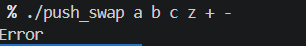

2. Duplicate numeric parameter: 
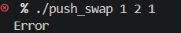

3. Greater than MAXINT: 
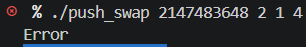

4. without any parameters: 
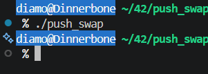

## Strategy selection -basic

### Eval requirement

	- Strategy Selection - Basic Tests
	Test the strategy selection flags. If most of these tests fail,
	no points will be awarded for this section.
	1. Run "$>./push_swap --simple 5 4 3 2 1" and verify it produces
	valid output that sorts the numbers.
	2. Run "$>./push_swap --medium 5 4 3 2 1" and verify it produces
	valid output that sorts the numbers.
	3. Run "$>./push_swap --complex 5 4 3 2 1" and verify it produces
	valid output that sorts the numbers.
	4. Run "$>./push_swap --adaptive 5 4 3 2 1" and verify it produces
	valid output that sorts the numbers.
	5. Verify that running without any flag defaults to --adaptive behavior.
	Note: At least 3 out of 5 tests should work for this section to pass.

### Tests

1. with simple: 
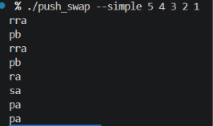

2. with medium: 
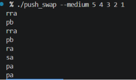

3. with comlex: 
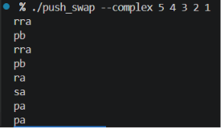

4. with adaptive: 
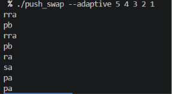

5. no flags: 
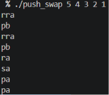

## Identity test

### Eval requirement

	- Identity test - Already sorted inputs
	Test push_swap's behavior with already sorted inputs.
	If most tests fail, no points will be awarded for this section.
	1. Run "$>./push_swap 42". The program should display nothing.
	2. Run "$>./push_swap 2 3". The program should display nothing.
	3. Run "$>./push_swap 0 1 2 3". The program should display nothing.
	4. Run "$>./push_swap 0 1 2 3 4 5 6 7 8 9". The program should display nothing.
	All tests should produce no output (0 instructions) since the inputs are already sorted.
	Note: At least 3 out of 4 tests should work correctly.

### Tests

1. ./push_swap 42  
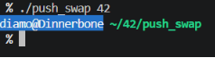

2. ./push_swap 2 3  
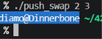

3. ./push_swap 0 1 2 3  
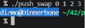

4. ./push_swap 0 1 2 3 4 5 6 7 8 9  
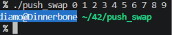

## Small inputs

### Eval requirements

	- Small inputs (3 numbers)
	Test with 3 numbers. Use the checker binary provided.
	1. Run "$>ARG="2 1 0"; ./push_swap $ARG | ./checker_linux $ARG".
	Check that the checker displays "OK" and that the number of
	instructions is reasonable (≤5 is acceptable, ≤3 is good).
	2. Test with other 3-number combinations like "0 2 1" or "1 0 2"
	and verify the checker displays "OK" with reasonable instruction count.
	Note: Some variation in instruction count is normal. Focus on correctness first.

### Tests

1. $>ARG="2 1 0"; ./push_swap $ARG | ./checker_linux $ARG 
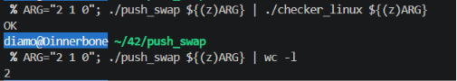

2. $>ARG="1 0 2"; ./push_swap $ARG | ./checker_linux $ARG 
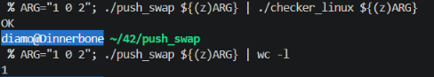

3. $>ARG="0 2 1"; ./push_swap $ARG | ./checker_linux $ARG 
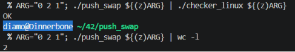

## Medium inputs

### Eval requirements

	- Medium inputs (5 numbers)
	Test with 5 numbers. Use the checker binary provided#
	1. Run "$>ARG="1 5 2 4 3"; ./push_swap $ARG | ./checker_linux $ARG".
	Check that the checker displays "OK" and that the number of
	instructions is reasonable (≤15 is acceptable, ≤12 is good).
	2. Test with 2-3 other combinations of 5 random numbers.
	Check that the checker displays "OK" and instruction count is reasonable.
	Example: try "5 1 4 2 3" or "3 5 1 4 2"
	Note: Different algorithms may produce different instruction counts.
	Correctness is more important than perfect optimization

### Tests

1. $>ARG="1 5 2 4 3"; ./push_swap $ARG | ./checker_linux $ARG 
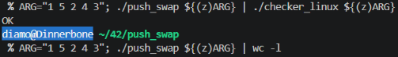

2. $>ARG="5 4 3 2 1"; ./push_swap $ARG | ./checker_linux $ARG 
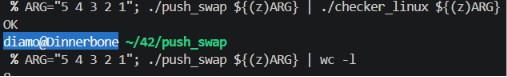

3. $>ARG="3 5 1 4 2"; ./push_swap $ARG | ./checker_linux $ARG 
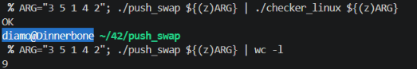